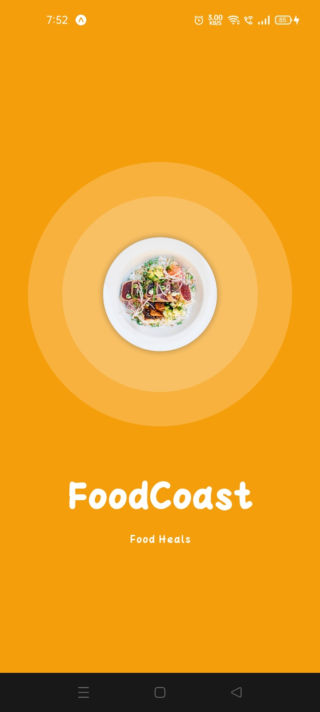
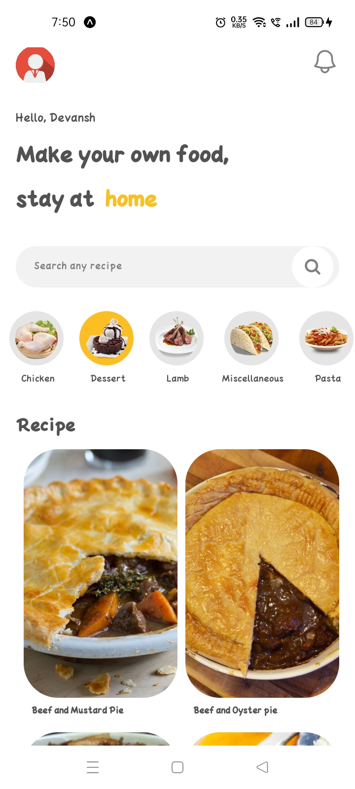
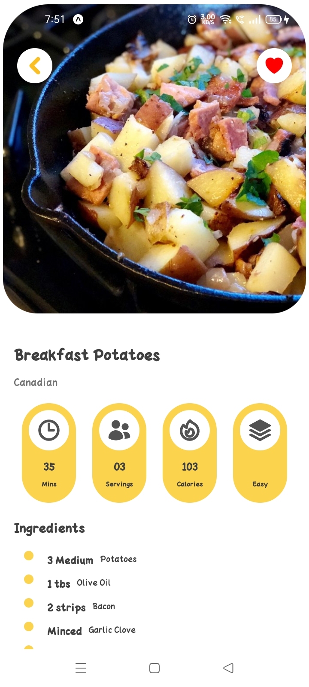
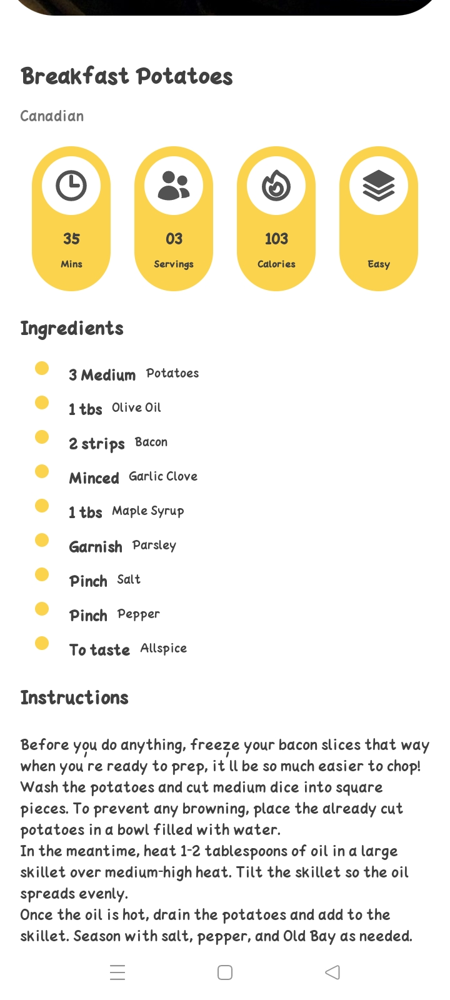

# Recipe App with React Native and Expo

This project is a Recipe App built using React Native and Expo. It allows users to browse through a collection of recipes, view detailed information about each recipe, and like their favorite recipes for future reference.

## Technologies Used

1. React Native with Expo
2. [React Navigation](https://reactnavigation.org/)
3. [React-native-reanimated](https://docs.swmansion.com/react-native-reanimated/)
4. [Native Wind](https://www.nativewind.dev/)
5. AsyncStorage (for storing images locally)
6. Axios (for fetching recipe data from an API)
7. React Native Youtube Iframe (to integrate the youtube video in app)
8. React Native Heroicons (for the icons)

Database for Meals: [themealsdb](https://www.themealdb.com/)

---

## Getting Started

1. **Clone the Repository**: Begin by cloning this GitHub repository to your local machine.
   `git clone <repository-url>`

2. **Navigate to the project directory**: `cd Recipe-App`

3. **Installation**: Install the necessary dependencies by running `npm install` or `yarn install` in the project directory.

4. **Running the Application**: Start the application by running `npm start` or `yarn start` in the project directory. Access the application by using the [expo app](https://play.google.com/store/apps/details?id=host.exp.exponent&hl=en_US&gl=US).
   Scan the QR-code or manually type the link while being on the same network.

---

## Screenshots

Here are some screenshots of the Recipe App:

   
   
   
   

---

## Acknowledgement

Special thanks to [codewithnomi](https://www.youtube.com/channel/UC9Z1XWw1kmnvOOFsj6Bzy2g) for providing the insightful tutorial on building the Recipe App with React Native and Expo.
